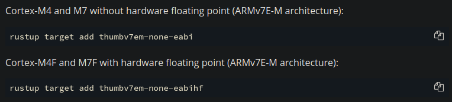

# Building a Real-time operating system for STM32Discovery

## Toolchain Basics
First of all it is necessary to set up the development environment. The host runs on Linux, so we need a suitable cross compiler toolchain to get source files ready for the cortex-m4 target.

As pointed out are there two possibilities. In our case we use the one with floating point support to achieve flexibility for further development steps.

We also have to prepare the debugger in the dev env, so we choose the one from ARM, called arm-none-eabi-* .

[Download ARM SDK](https://developer.arm.com/-/media/Files/downloads/gnu-rm/10.3-2021.07/gcc-arm-none-eabi-10.3-2021.07-x86_64-linux.tar.bz2)

1. Extract to /usr/share
2. Link necessary tools with su rights:

sudo ln -s /usr/share/{your version}/bin/arm-none-eabi-{tool} /usr/bin/arm-none-eabi-{tool}

   